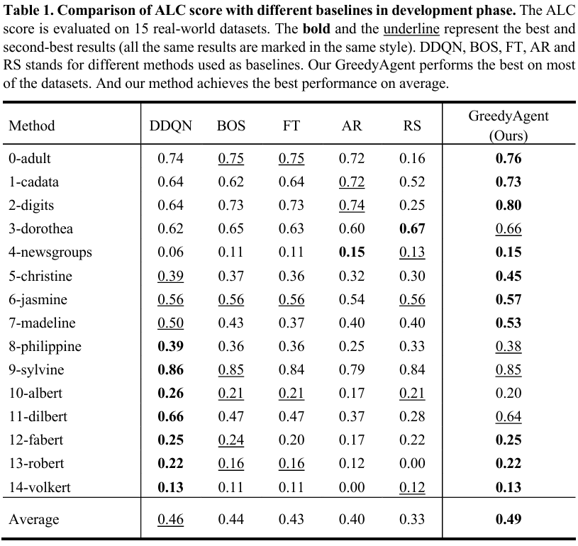
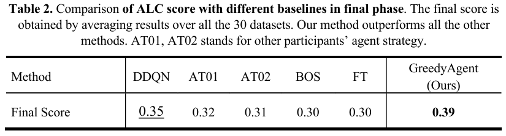

# MetaLC-2nd-Round: GreedyAgent
🎉Winning method (1st place in 47 participants) in [Meta-learning from Learning Curves - 2ND ROUND competition](
https://codalab.lisn.upsaclay.fr/competitions/4894)@AutoML Conference 2022

🎉\[GreedyAgent: Crafting Efficient Agents for Meta-learning from Learning Curves via Greedy Algorithm Selection\] Paper accepted by ICIC 2024! You can view it in this repo.

## GreedyAgent
This repository provides the official python implementation of GreedyAgent.

### Pipeline

<div align="center">
  
</div>

### Algorithm

The schematic diagram of our GreedyAgent is as below.
<div align="center">
  
</div>

## Results
<div align="center">
  
</div>

<div align="center">
  
</div>

## Installation
### 1. Download and Prepare Starting Kit
Starting kit is provided in official codalab page.
```console
cd starting_kit/

pip install virtualenv

python -m virtualenv metaLC-challenge

source metaLC-challenge/bin/activate

python -m pip install -r requirements.txt
```
### 2. Replace agent.py
Replace the file: *sample_code_submission/agent.py*.

Starting kit provided two sample agents for references:

- Random Search agent
- Average Rank agent

### 3. Test the implemented agent with the sample data provided
```console
cd starting_kit/

source metaLC-challenge/bin/activate

python3 ingestion_program/ingestion.py

python3 scoring_program/score.py
```

The results and visualizations will be written to these following files:

 *starting_kit/output/scores.txt*

 *starting_kit/output/scores.html*

NOTE: Performing well on the sample (synthetic) data does NOT guarantee your agent will perform well on the real data used for testing and ranking in our competition.
